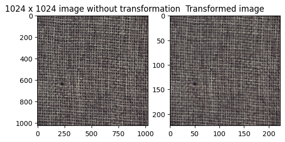

# Anomaly Detection on MVTec AD (Carpet)

This repository explores methods for unsupervised anomaly detection on the MVTec AD dataset, focusing on the 'carpet' class. The project demonstrates a progression from simple autoencoders to advanced feature-based and transformer-based approaches, with clear visualizations and benchmarking.

---

## Dataset

We use the [MVTec Anomaly Detection (MVTec AD)](https://www.mvtec.com/company/research/datasets/mvtec-ad) dataset, a real-world benchmark for unsupervised anomaly detection. This project focuses on the 'carpet' class, which contains high-resolution images of carpets with various types of defects (color, cut, hole, metal contamination, thread) and normal samples.

Some sample images from the notebooks(they contain much more visualization):
In test/ we have the defective images, and in ground truth/ you have respective segmentation masks. By mistakes this plot did not account for grayscale mask instead of RGB, but the mask is stil correct albeit viridis.

Scaled images

Reconstruction loss heatmap for autoencoder approach

2D t-SNE plot of ResNet50 features

Resnet with autoencoder reconstruction loss heatmap sample

Anamoly score distribution for PatchCore

Anamoly score distribution for ViT + KNN

---

## Methodologies

### 1. Autoencoder Baseline

- **Notebook:** [train_autoencoder.ipynb](https://github.com/Dd1235/TinkerWithCV/blob/main/MVTec_AD/models/train_autoencoder.ipynb)
- **Summary:** Trains a simple convolutional autoencoder directly on image pixels. The model learns to reconstruct normal images; reconstruction error (L2 loss) is used as the anomaly score. **Reconstruction loss heatmaps** are used to visualize where the model detects anomalies.
- **Result:** AUC ≈ 0.44 (worse than random). Demonstrates the limitations of pixel-space autoencoders for complex textures.

### 2. ResNet50 + KNN (Feature Memory Bank)

- **Notebook:** [resnet_knn.ipynb](https://github.com/Dd1235/TinkerWithCV/blob/main/MVTec_AD/models/resnet_knn.ipynb)
- **Summary:** Uses a pre-trained ResNet50 as a feature extractor. Features from normal ("good") training images are stored in a memory bank. For a test image, features are extracted and compared to the memory bank using K-nearest neighbors (KNN); the mean distance to the k closest features is the anomaly score. **Thresholding (mean + 2\*std)** is used to classify anomalies. **t-SNE plots** are used to visualize feature separability.
- **Result:** AUC ≈ 0.74. Shows the power of deep features and simple non-parametric scoring.

## Model 3: Resnet backbone with autoencoder

- Notebook: [resnet_backbone.ipynb](https://github.com/Dd1235/TinkerWithCV/blob/main/MVTec_AD/models/resnet_backbone.ipynb)
- the ResNet50 model as a feature extractor and then used an autoencoder to reconstruct the features.
- This approach gave an AUC of 0.99, but the autoencoder takes training time.
- This method is also from a paper.

## Model 4: PatchCore

- Notebook: [patch_core.ipynb](https://github.com/Dd1235/TinkerWithCV/blob/main/MVTec_AD/models/patch_core.ipynb)
- A simplified implementation of PatchCore, as described [here](https://arxiv.org/abs/2106.08265)
- It is similar to the second method, except that it uses a memory bank of patches instead of the entire image features.
- It gave an AUC of 0.98 and does not have the overhead of training time of autoencoder, simply using pretrained ResNet50.

## Model 5: ViT and KNN

- Notebook: [vit_knn.ipynb](https://github.com/Dd1235/TinkerWithCV/blob/main/MVTec_AD/models/vit_knn.ipynb)
- Used a pre-trained Vision Transformer (ViT) model to extract features.
- Only used the cls label embedding, to reduce training time.
- Created a memory bank of features from the training set.
- Used the k-nearest neighbors (KNN) algorithm to compute the anomaly score.
- Achieved AUC of 0.95, this is only ViT and KNN, did not use patch embeddings, no autoencoder, entirely trained on CPU because i ran out of gpu free credits, yet it performed well.

## Model 6 and 7: Pixel space autoencoder with skip connections (with MSE loss and SSIM loss)

- Notebook: [skipae.ipynb](https://github.com/Dd1235/TinkerWithCV/blob/main/MVTec_AD/models/skipae.ipynb)
- First I made a ae model but used symmetrical skip connections to reconstruct the image.
- It was trained on just the good images, and then used to reconstruct.
- The reconstruction is pretty good, good enough that even faulty images are reconstructed well, This has the lowest AUC at 0.41, worse than normal autoencoder.
- I also tried using SSIM loss instead of MSE, it significantly improved this model to 0.56 AUC, same model, same epochs, just different loss metric. Still pretty bad performance, as expected of pixel space autoencoders.

Plans:

Also looking to expand from carpets to other classes as well, and deploy model for small demo.

I also want to look into feature extractor backbone + VAE instead. I might perform better for generalized usecases where we can get image from different angles, and offsets etc.

Will also look into more VAE + FSL possibilities.

## Notebooks

- [EDA & Dataset Download](https://github.com/Dd1235/TinkerWithCV/blob/main/MVTec_AD/eda/eda.ipynb): Exploratory data analysis, dataset structure, and citation/license details.
- [Make Dataset](https://github.com/Dd1235/TinkerWithCV/blob/main/MVTec_AD/eda/make_dataset.ipynb): PyTorch dataset and dataloader creation.
- [Autoencoder Baseline](https://github.com/Dd1235/TinkerWithCV/blob/main/MVTec_AD/models/train_autoencoder.ipynb)
- [ResNet50 + KNN](https://github.com/Dd1235/TinkerWithCV/blob/main/MVTec_AD/models/resnet_knn.ipynb)
- [ResNet50 + Autoencoder](https://github.com/Dd1235/TinkerWithCV/blob/main/MVTec_AD/models/resnet_backbone.ipynb)
- [PatchCore](https://github.com/Dd1235/TinkerWithCV/blob/main/MVTec_AD/models/patch_core.ipynb)
- [ViT + KNN](https://github.com/Dd1235/TinkerWithCV/blob/main/MVTec_AD/models/vit_knn.ipynb)

---

## Skills & Tools

- **Deep Learning:** PyTorch, torchvision, transformers
- **Computer Vision:** Feature extraction, autoencoders, memory banks, anomaly detection
- **Visualization:** Matplotlib, seaborn, t-SNE, heatmaps
- **Experimentation:** Jupyter Notebooks, Colab, Implementing papers, and also implementing my own ideas using the papers, like using Vision Transformer backbone instead of ResNet50 etc.
- **Reproducibility:** Dataset download, preprocessing, and clear notebook structure

---

## References

- MVTec AD Dataset: Paul Bergmann, Michael Fauser, David Sattlegger, and Carsten Steger, "A Comprehensive Real-World Dataset for Unsupervised Anomaly Detection", CVPR 2019. [[project page](https://www.mvtec.com/company/research/datasets/mvtec-ad)]
- PatchCore: Neumann, Lukas, et al. "PatchCore: Towards Total Recall in Industrial Anomaly Detection." CVPR 2021. [[arXiv](https://arxiv.org/abs/2106.08265)]
- [Towards Total Recall in Industrial Anomaly Detection (PatchCore)](https://arxiv.org/abs/2106.08265)

---

## Future Work

- Expand to other MVTec AD classes beyond carpets.
- Deploy a demo for real-time anomaly detection.
- Explore feature extractor backbones with variational autoencoders (VAE) and few-shot learning (FSL) approaches.
